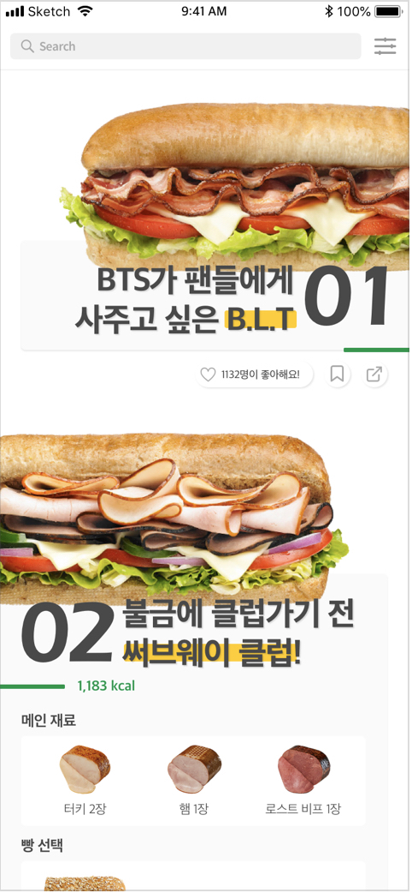
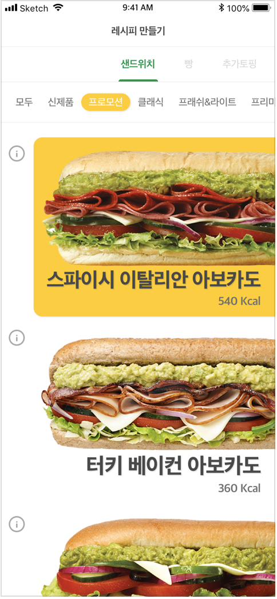
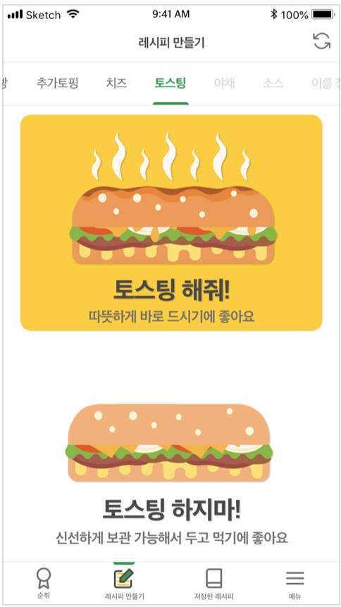

# 팀 프로젝트 Subway

스터디 팀 프로젝트 Subway
샌드위치 프랜차이즈인 Subway의 주문을 편하게 해주기 위해 기획한 프로젝트

개개인이 원하는 레시피를 만들어 저장하고, 친구에게 공유도 하고, 다른 유저들로 부터 하트까지 받을 수 있는 앱!

# 기능
- SNS 기반 로그인
- 레시피 만들기
- 샌드위치 재료 및 영양정보 확인
- 저장된 레시피 컬렉션 만들기

# 사용한 Open Source

 - Alamofire : https://github.com/Alamofire/Alamofire
 - SwiftyJSON : https://github.com/SwiftyJSON/SwiftyJSON
 - FacebookLogin : https://developers.facebook.com/docs/facebook-login/v2.2?locale=ko_KR
 - 카카오톡 로그인 : https://developers.kakao.com/features/platform#%EC%82%AC%EC%9A%A9%EC%9E%90-%EA%B4%80%EB%A6%AC
 - RealmSwift : https://github.com/realm/realm-cocoa

# 이미지

